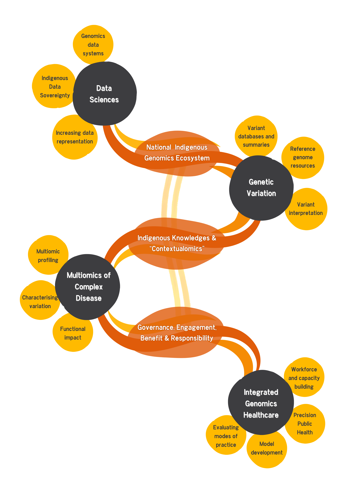

# Our story
At Black Ochre Data Labs our purpose is to reduce health inequality through the power of genomics. We are working towards this goal through funded research projects and by building national partnerships in Indigenous genomics. Our primary areas of focus are: Data Sciences, Genetic Variation, Multiomics of Complex Disease and Integrated Genomics Healthcare. Across each of these focus areas is a dedication to governance, community engagement, delivering benefit to communities and our responsibility to the communities and participants that we are so honoured to work with. 

# Funded Research Projects

## PROPHECY

We work together with the Wardliparingga Aboriginal Health Equity team at [SAHMRI](https://sahmri.org.au/research/themes/aboriginal-health/programs/implementation-science/projects/the-prophecy-diabetes-multi-omics-cohort-study) on the PROPHECY cohort for the Aboriginal Diabetes Study. PROPHECY (**P**redicting **R**enal, **Op**hthalmic and **H**eart **E**vents in the Aboriginal **C**ommunit**y**) is a research study looking at Type 2 Diabetes (T2D) and complications in Aboriginal communities across South Australia. It is a large population-based prospective cohort of Aboriginal adults with longitudinal follow-ups currently in progress. The aim of the study is to use multiomics and comprehensive phenotyping to assess the disease burden and propensity for complication development in Aboriginal people with or at risk of T2D. With this research we hope to better understand the psychosocial, environmental, clinical and genomic predictors of disease and disease progression in order to improve health outcomes for Indigenous Australians.

This project is funded by the National Health and Medical Research Council and the Australian Government.

## Marine Biomass Innovation Project

The [Marine Biomass Innovation (MBI) Project](https://mbiproject.ca/) is a trandisciplinary research project based in Newfoundland, Canada that seeks to apply a novel integrated approach for repurposing marine biomass to improve economic sustainability of rural coastal, remote and Indigenous communities in two sub-regions of Western Newfoundland (Bay St. George and Bay of Islands). It is a collaborative project involving researchers from five Candian and five international Universities, six Mi'kmaw governing organisations (Flat Bay Band, Benoit First Nation, St. George's Indian Band, Three Rivers Band and Benoit's Cove Indian Band (Miawpukek First Nation) and ocean-based industry partners.

Marine biomass is the waste left behind after processing marine products like fish heads, shrimp shells and other discarded animal or plant products. In Newfoundland, 30-70% of the marine biomass harvested is discarded as waste as current approaches focus on Western knowledge systems and often devalue Indigenous knowledge systems and cultural practices of harvesting. Newfoundland has unique marine life that is underutilised and little economic benefit is returned to rural, coastal and Indigenous communities from these ocean-based assets. A vital component of the MBI project is the practice of Etuaptmumk (*pronounced: eh-doo-ahp-duh-mumk*) or Two-Eyed Seeing, a term coined by Mi'kmaq Elder Albert Marshall of Eskasoni First Nation (Nova Scotia, Canada) who defines the term as "Learning to see from one eye with the best in the Indigenous ways of knowing, and from the other eye with the best in the Western ways of knowing and LEARN to use both these eyes together for the benefit of all". Employing Mi'kmaw Indigenous Knowledge throughout the MBI allows the project to practice Etuaptmumk. Fundamentally, the MBI project strives to understand community priorities, engrain traditional knowledge and oral histories into academic scientific research, collaborate to understand community assets and gifts and help to build on these. For more on the concept of Etuaptmumk, [watch](https://www.youtube.com/watch?v=qoR4nnzG13U) Elder Albert Marshall discuss how it can be a guiding framework in working toward reconciliation with the earth.

Two members of our team at Black Ochre Data Labs work on the MBI project in a Data Systems and Indigenous Data Sovereignty capacity.

This project is funded by the federal Canadian New Frontiers Research Fund-Transformation.

# National Partnerships
At Black Ochre Data Labs we are part of a national network of experts in Indigenous health equity, genomics, governance, policy, epidemiology and bioinformatics who have come together to build a national Indigenous Genomics consortium. Key partners in this endeavour are the [Australian Alliance for Indigenous Genomics (ALIGN)](https://indigenousgenomics.com.au/) and the [National Centre for Indigenous Genomics (NCIG)](https://ncig.anu.edu.au/) at Australian National University. This consortium will establish the foundations on which Indigenous Australians can equitably benefit from the health promoting, preventative, diagnostic and curative potential of genomics.
